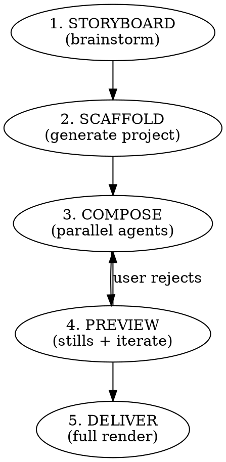

# Demo Video

## Overview

Director-style skill. You're building a short product demo (20–60s) with animated UI mockups and procedural music. You run through **5 phases in order** and must not skip phases — each phase closes a class of bug that bites in later phases if skipped.

## When to Use

- User asks to "make a demo video", "create a promo clip", "generate an animated walkthrough"
- User wants to show a product/feature as a video without recording a real screen
- Needs to be reproducible from the terminal (no external tools, no drag-and-drop editors)

**Don't use for:** Recording an actual screen cast (use OBS/Playwright recording), cinematic video with real footage, one-shot "just show me this scene" requests.

## The 5 Phases (MANDATORY ORDER)



Each phase has a dedicated reference. Read the reference BEFORE starting the phase.

| Phase | Reference | What it produces |
|-------|-----------|------------------|
| 1. Storyboard | `references/storyboarding.md` | `storyboard.yaml` validated by user |
| 2. Scaffold | `references/scaffold.md` | `demo-video/` project bootstrapped, design tokens imported, anchor stubs created |
| 3. Compose | `references/cursor-anchors.md`, `references/motion-design.md`, `references/music-theory-lofi.md` | scenes coded, synth tuned, via parallel agents |
| 4. Preview | `references/preview-iteration.md` | stills per scene, user-approved |
| 5. Deliver | (inline below) | MP4 at target location |

## Hard Rules (Iron Law)

These rules exist because every single one of them was violated in the session that birthed this skill, and each violation cost an iteration loop. Do not rationalize around them.

1. **STORYBOARD FIRST, ALWAYS.** No code before a `storyboard.yaml` is written and the user has approved it. If the user says "just build it", push back with a 90-second storyboard proposal.
2. **ANCHORS, NEVER PIXELS.** Cursor positions use named anchors from a shared `anchors.ts`. Never put raw `x: 146, y: 395` in cursor keyframes. See `references/cursor-anchors.md`.
3. **STILLS BEFORE FULL RENDER.** Render one still per scene via `npx remotion still` at the frame where the cursor clicks. If any still shows the cursor off-target or text overlapping, iterate BEFORE full render. See `references/preview-iteration.md`.
4. **MUSIC THEORY BEFORE SYNTH.** The synth script must cite its key/progression/tempo in a header comment and justify why it's appropriate to the video tone. Sad chord progressions (minor tonic, slow, descending resolutions) are the default failure. See `references/music-theory-lofi.md`.
5. **NO TREMBLE.** Beat-synced scale pulses on UI elements produce "trembling" perception. Use only opacity/glow intensity for beat sync, never scale. See `references/motion-design.md`.
6. **PARALLEL AGENTS FOR COMPOSE PHASE.** Dispatch independent subagents for (a) music synthesis, (b) each independent scene, (c) QA layout audit. Sequential coding is a smell.

## Quick Reference — Common Operations

```bash
# Phase 2 — bootstrap new project
bash ~/.claude/skills/demo-video/scripts/init.sh <target-dir> [--tokens <path-to-theme.ts>]

# Phase 4 — render a single frame for review
cd <demo-video-dir>
npx remotion still DemoComposition out/scene-2-click.png --frame=260

# Phase 5 — full render
npx remotion render DemoComposition out/demo.mp4
cp out/demo.mp4 <target-location>

# Regenerate audio
PY="$(which python)"
$PY scripts/synth_lofi.py
ffmpeg -y -i public/lofi.wav -b:a 192k public/lofi.mp3
```

## Common Mistakes (The Rationalization Table)

These are the exact excuses that led to wasted iterations in the baseline session. When you hear yourself thinking one of these, STOP.

| Rationalization | Reality | Counter |
|-----------------|---------|---------|
| "The user gave clear requirements, I can skip storyboard." | You'll get 3 correction rounds. Every time. | Propose a 5-minute storyboard in writing. User approves in 30s. |
| "Pixel math is fast, I'll measure and hardcode." | Layout changes break every cursor. | Use anchor constants shared between element + cursor. |
| "I'll render full video once, then fix." | Full render = 2-5 min per iteration. Stills = 10s. | Render a still at each click-frame first. |
| "Lofi = jazz chords = fine." | Minor-tonic progressions sound sad. 75 BPM drags. | Cite progression + tempo in script header. F/Bb/Eb major. 80-88 BPM. |
| "Scale pulse = beat sync = dynamic." | At even 1.008x the UI trembles. | Beat-sync glow intensity or opacity only. |
| "I'll write all scenes myself, faster than dispatching." | You blow 40 min linear. Agents in parallel = 10 min. | Dispatch music + scene-N + QA agents concurrently. |
| "Click target appears at the same frame as the click — close enough." | Cursor clicks void. Viewer sees the click land on nothing. | Target element must render BEFORE the click frame. See the `storyboarding.md` quality checks. |
| "Theme re-export via absolute path works, init ran fine." | Git Bash absolute paths (`/c/...`) aren't valid TS module paths. Breaks at tsc. | Use `theme.source.ts` copy pattern from `init.sh` — always run `tsc --noEmit` after scaffold. |
| "Scaffold compiled, no need for the still check." | A missing scene stub compiles fine but renders a broken frame. | MANDATORY `npx remotion still --frame=30` after scaffold. 10s saves a full-render debug loop. |

## Phase 5 — Deliver (inline)

Once all stills are approved:

```bash
cd <project>
npx remotion render DemoComposition out/demo.mp4
cp out/demo.mp4 <final-location>
```

Report back to user with: file path, size, duration, and the `storyboard.yaml` commit reference.

## Red Flags — STOP

- Writing a scene `.tsx` file before `storyboard.yaml` exists → STOP, storyboard first
- Raw `x: NNN, y: NNN` in a cursor keyframe → STOP, use anchors
- Claiming "the demo is done" without approved stills → STOP, render stills
- Python synth file missing a docstring with key/BPM/progression → STOP, document the music theory
- Any `transform: scale(${... beat ...})` on a UI element → STOP, swap to glow/opacity

All of these mean: stop, fix the root discipline, then continue.
